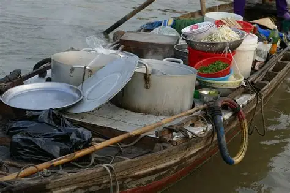

# sun-lock

## SUN LOCK

### Introduction

[https://github.com/vietphan1995/sun-lock.git](https://github.com/vietphan1995/sun-lock.git)

SUN LOCK is a pot that has lid can be opened and closed in screw way, this makes food contained in was not overflown/spilled when using for safety, delivery performance.

SUN LOCK has dock goes with burn dock, can be opened and closed in screw way also.

SUN LOCK can save energy in cooking process, keep temperature, safety, reduce climate change by replacing plastic by metal material built in. In advance, SUN LOCK ecosystem improve food delivery and keeping services, especially reducing plastic bag and cleaning step, units communication, …

[back to git projects …](https://github.com/vietphan1995/projects)

### Notes
https://phantrungviet.notion.site/sun-lock-1b45e832d6ee80a09d82f7a3e8daee73